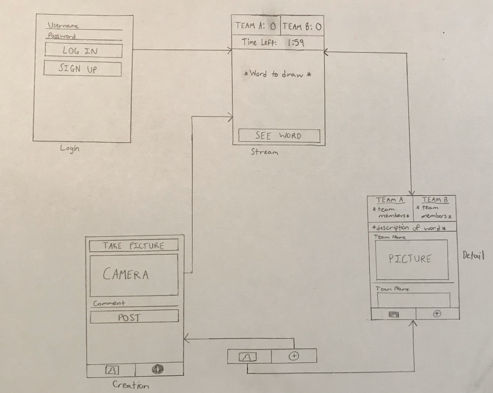

Original App Design Project - README
===

# DrawThat

## Table of Contents
1. [Overview](#Overview)
1. [Product Spec](#Product-Spec)
1. [Wireframes](#Wireframes)
2. [Schema](#Schema)

## Overview
### Description
App similar to pictionary game. DrawThat is played locally with a group of people. Allows for sharing of pictures created while playing.

### App Evaluation
- **Category:** Game / Entertainment
- **Mobile:** This app would work best on a mobile device. It could potentially be used on computers and laptops later, but mobile would likely deliver the best experience.
- **Story:** App facilitates playing a pictionary-like game in-person. Keeps track of score, provides words to draw, and allows for user sharing.
- **Market:** App is good for any age group. People would register as a group rather than as an individual.
- **Habit:** App could be used whenever a group of people would like to play.
- **Scope:** Would start off with necessary features such as keeping score, providing words, and sharing with others. Could then expand on this in various ways such as allowing the user to draw pictures on the app and leaving comments on posts.

## Product Spec

### 1. User Stories (Required and Optional)

**Required Must-have Stories**

* User can register as a group.
* User can login.
* User can pick number of teams.
* User can resume last game or start new game.
* App picks random word for user to draw.
* App keeps time for drawing phase.
* Game loop (start round, app picks word, user draws, end round).
* User can use app to keep score.
* User can take a picture of their drawings.
* User can post pictures.
* User can see other groups' pictures in feed.
* ...

**Optional Nice-to-have Stories**

* User can name the teams.
* User can select difficulty of words.
* User can save multiple different games.
* ...

### 2. Screen Archetypes

* Login
   * User can register with a group
   * User can sign in or sign up
   * User chooses the number of teams participating
* Stream
   * Display random words to be drawn by players
   * Clock/Timer for increased competitiveness. Basically, users have a time limit to draw
   * Display teams and their total scores
* Detail
   * See drawings of user's team or other teams
   * See team members
   * See description of word to draw
* Creation
   * User can take picture of drawing
   * Post pictures with comments to social media or feed

### 3. Navigation

**Tab Navigation** (Tab to Screen)

* Detail
* Creation

**Flow Navigation** (Screen to Screen)

* Login
   * Stream
* Stream
   * Detail
* Detail
   * Creation
   * Stream
* Creation
   * Detail
   * Stream

## Wireframes


### [BONUS] Digital Wireframes & Mockups

### [BONUS] Interactive Prototype

## Models

## Schema

### Post

| Property	    | Type	   | Description                                    |
| ------------- | -------- | ---------------------------------------------- |
| objectId	    | String	 | unique id for the user post (default field)    |
| Username	    | String   | Username of author/team                        |
| image	        | File	   | image of drawing that user posts               |
| caption	      | String	 | image caption/description by author/team       |
| createdAt	    | DateTime | date when post is created (default field)      |
| updatedAt	    | DateTime | date when post is last updated (default field) |
| likesCount	  | Number	 | number of likes for the post (optional)        |
| commentsCount | Number   | number of comments for the post (optional)     |

### Phrase

| Property      | Type     | Description                                    |
| ------------- | -------- | ---------------------------------------------- |
| objectId      | String   | unique id for the user/team post               |
| difficulty    | Number   | Difficulty of word/phrase to draw              |
| name          | String   | Word or phrase to be drawn                     |
| createdAt	    | DateTime | date when post is created (default field)      |
| updatedAt	    | DateTime | date when post is last updated (default field) |

## Networking
* Login Screen
    * Login with username and password
    ```java
    private void loginUser(String username, String password) {
        Log.i(TAG, "Attempting to login user " + username);
        ParseUser.logInInBackground(username, password, new LogInCallback() {
            @Override
            public void done(ParseUser user, ParseException e) {
                if (e != null) {
                    Log.e(TAG, "Issue with login", e);
                    Toast.makeText(LoginActivity.this, "Issue with login!", Toast.LENGTH_SHORT).show();
                    return;
                }
                goMainActivity();
                Toast.makeText(LoginActivity.this, "Success!", Toast.LENGTH_SHORT).show();
            }
        });
    }
    ```
    * (Create/Post) Create an account
    ```java
    private void signupUser(String username, String password) {
        Log.i(TAG, "Attempting to sign up user " + username);
        ParseUser user = new ParseUser();
        user.setUsername(username);
        user.setPassword(password);
        user.signUpInBackground(new SignUpCallback() {
            @Override
            public void done(ParseException e) {
                if (e != null) {
                    Log.e(TAG, "Issue with sign up", e);
                    Toast.makeText(LoginActivity.this, "Issue with sign up!", Toast.LENGTH_SHORT).show();
                    return;
                }
                goMainActivity();
                Toast.makeText(LoginActivity.this, "Success!", Toast.LENGTH_SHORT).show();
            }
        });
    }
    ```
* Stream Screen
  * (Read/GET) query random word/phrase by difficulty level to be displayed to players
    ```java
    ParseQuery<Phrase> query = ParseQuery.getQuery(Phrase.class);
    query.whereEqualTo(Phrase.KEY_DIFFICULTY, difficulty);
    query.addDescendingOrder(Phrase.KEY_CREATED_AT);
    query.findInBackground(new FindCallback<Phrase>() {
        @Override
        public void done(List<Phrase> phrases, ParseException e) {
            if (e != null) {
                Log.e(TAG, "Issue with getting phrases", e);
                return;
            }
            for (Post phrase : phrases) {
                Log.i(TAG, "Phrase: " + phrase.getName() + ", difficulty: " + phrase.getDifficulty);
            }
            // TODO: randomly select a phrase from the list...
        }
    });
    ```
* Detail/Feed Screen
  * (Read/GET) Query all posts where user/team is author
  * (Create/POST) Create a new like on a post (optional)
  * (Delete) Delete existing like (optional)
  * (Create/POST) Create a new comment on a post (optional)
  * (Delete) Delete existing comment (optional)
* Creation Screen
  * (Create/POST) Create a new post object


- [Create basic snippets for each Parse network request]
- [OPTIONAL: List endpoints if using existing API such as Yelp]
